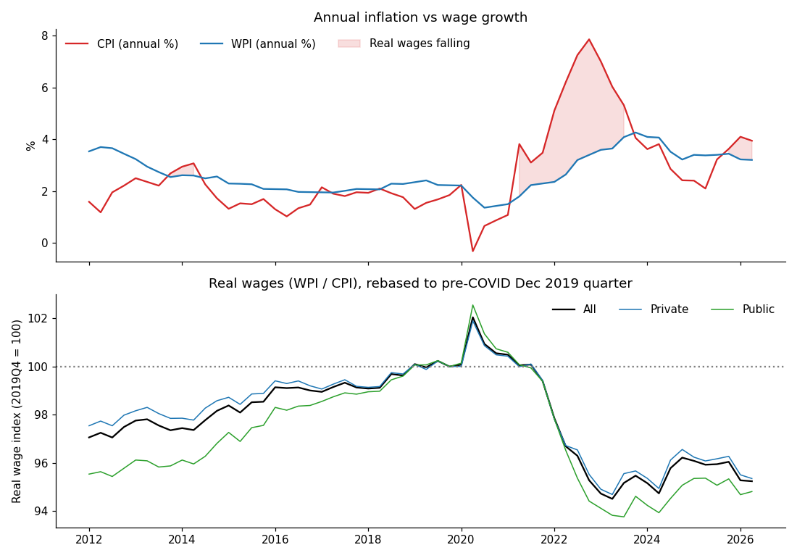

# Australian Wage Growth vs Inflation — CPI vs WPI

## What this repo contains
An **independently re-executed recovery** of notebook logic recorded in a Claude conversation. The analysis is reproduced using **real, user-uploaded ABS workbooks**, copied unchanged into `data/`. It is not evidence that the user's earlier RMIT R/ggplot2 project used these exact data, methods, or results. The Python notebook is derived from Claude's recovered tool logs and has now been executed and checked.

## Research question
Have Australian wage index movements kept pace with consumer-price inflation? Contrast headline annual CPI and WPI changes, the purchasing-power proxy WPI/CPI, and original private/public WPI indices.

## Data and definitions
- CPI, quarterly all groups Australia, original (ABS series **A2325846C**).
- WPI, original, all-industries total hourly rates of pay excluding bonuses, private and public combined (**A2603609J**), private (**A2603039T**) and public (**A2603989W**); annual original WPI growth validation (**A2603611V**).
- Aligned sample: **1997 Q3–2026 Q2**, 116 quarters. Four missing entries are initial published WPI annual-growth series observations; core CPI and WPI index values were present for all aligned quarters.
- YoY change: `100 * (index / index.shift(4) - 1)`.
- Annual real-wage-growth proxy: `100 * ((1 + WPI_yoy/100) / (1 + CPI_yoy/100) - 1)`.
- Real-wage index proxy: `100 * (WPI / CPI)`; plotted relative to **2019 Q4 = 100**. The absolute levels of the two underlying indices are based on distinct index bases, so only changes in the ratio are interpreted.

## Analysis figure



*Figure generated from the two ABS workbooks in `data/` by the executed recovery notebook; it is **not** the unrecovered original RMIT/RPubs chart.*

## Verified calculations (re-executed 2 October 2026)
- In **2026 Q2**, annual CPI growth was **3.94%**, annual WPI growth **3.20%**; computed annual real wage proxy growth **−0.71%**.
- Real-wage proxy in 2026 Q2 was **4.76% below 2019 Q4**, using the unchanged WPI/CPI ratio.
- In **2021 Q2–2023 Q3**, annual real-wage-growth proxy was negative for **10 consecutive quarters**. This is *annual growth negative for successive quarters*, not a claim that the quarterly index fell every quarter.
- A 2020 Q2 ratio peak, influenced by an unusual CPI dip, gives a more pronounced peak-to-trough figure; the **2019 Q4 comparison is preferred** for pre-pandemic context. See `outputs/` for full precision, sector comparisons and subperiods.

## Verification
The executed notebook passed: (1) computed WPI annual growth against the ABS-published WPI change series (maximum absolute difference **0.049 percentage points** over 112 quarters), and (2) calculated CPI growth against the reference quarterly figures embedded in Claude's recorded notebook (max difference under 0.1 percentage points). The second check corroborates the recorded reference values but is not an independent download of a published comparison table.

## Run
```bash
python -m pip install -r requirements.txt
cd notebooks
jupyter notebook analysis_EXECUTED.ipynb
```
Install Jupyter separately if it is not already installed. Run all cells from the top. The notebook reads `../data/6401017.xlsx` and `../data/634501.xlsx`. The file `notebooks/analysis.ipynb` is the recovered notebook before execution; `analysis_EXECUTED.ipynb` contains the newly generated outputs.

## Directory
- `data/`: **unchanged ABS workbooks** plus official source and series record
- `notebooks/`: recovered source notebook and independently executed notebook
- `images/`: generated chart PNG
- `outputs/`: computed aligned dataset, identified negative-growth episodes, sector/subperiod tables and JSON key results
- `requirements*.txt`: packages and versions from this verification environment
- `PROVENANCE_AND_LIMITATIONS.txt`: distinction between old coursework, Claude rebuild and current verification

## Limitations
This *index-ratio proxy* is not a measure of individual real take-home pay or household purchasing power. WPI measures wage changes for a fixed basket of jobs; CPI is consumer prices for a reference basket. The comparison omits changes in hours worked, job composition, taxes, income transfers and household spending mix. Unadjusted quarterly levels have seasonality; year-on-year rates are used for comparisons. The **2020 Q2 CPI fall** makes peak selection sensitive. The original historical RMIT RPubs submission and its own numerical results were not recovered.

## Attribution
Data: Australian Bureau of Statistics, Consumer Price Index, Australia (August 2026), Table 17; Wage Price Index, Australia (June quarter 2026), Table 1. Official source links and licence notes are in `data/SOURCE.txt`.
